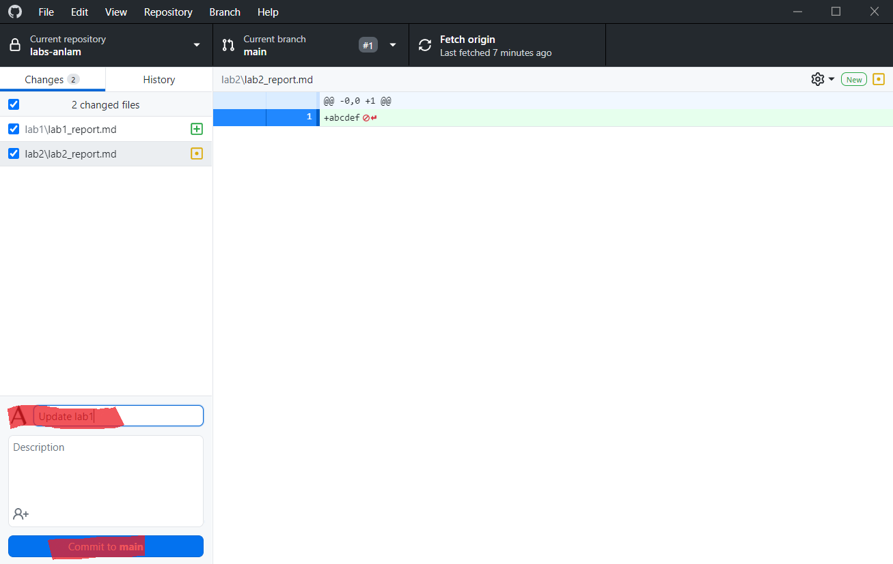
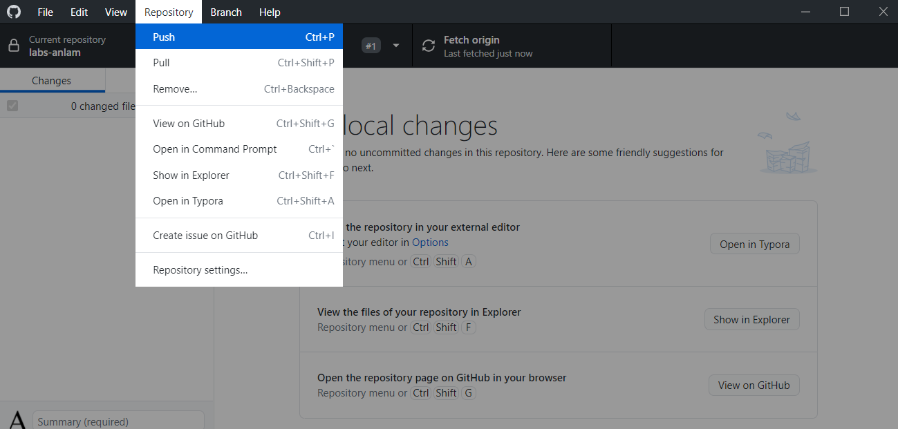
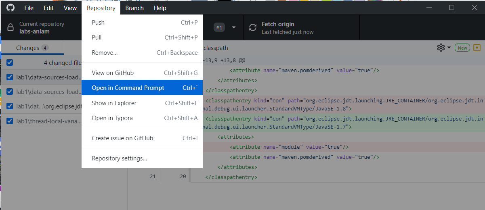
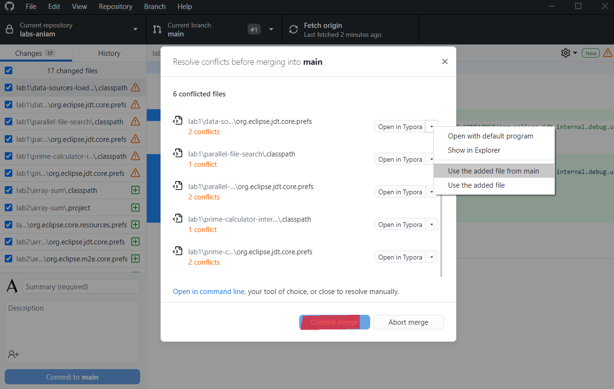

<h1 align="center"> ITF23019 - Parallel and Distributed Programming </h1>
<h3 align="center"> Spring 2021 </h2>
<h3 align="center"> Lab 2: Thread Executor </h2>


In this lab, you will learn how to manage a lot of thread with Java Executor. 

## Submission Deadline:

You need to commit your codes and lab report to your GitHub repository **before 10:00 AM Monday 1st February**.

## GitHub

To access the class GitHub, you need to accept the invitation we sent recently. Please go to https://github.com/ITF23019 and accept the invitation on the top of page. Then, you will have access to following repositories: `labs` and `lectures`. 

The instruction and code of the labs will be posted in the `labs` repository. To copy those files to your local repository (`labs-yourusername`), you can either manually copy the file or follow below steps to configure the setting of your local repository:

1. Commit and push the changes of `lab1` to your GitHub repository (`labs-yourusername`)

   

   

2. Open the Command Prompt:

   
   
3. Run the following command:

   ```bash
   > git remote -v
   origin  https://github.com/ITF23019/labs-anlam.git (fetch)
   origin  https://github.com/ITF23019/labs-anlam.git (push)
   
   > git remote add upstream https://github.com/ITF23019/labs.git
   
   > git remote -v
   origin  https://github.com/ITF23019/labs-anlam.git (fetch)
   origin  https://github.com/ITF23019/labs-anlam.git (push)
   upstream        https://github.com/ITF23019/labs.git (fetch)
   upstream        https://github.com/ITF23019/labs.git (push)
   
   > git pull upstream main --allow-unrelated-histories
   From https://github.com/ITF23019/labs
    * branch            main       -> FETCH_HEAD
    * [new branch]      main       -> upstream/main
   Already up to date.
   ```

4. If you get any conflicts, go back and resolve all the conflicted files with **Use the added file from main** to keep your original files.

   

5. Once every conflict is resolved, `Commit merge` and push the changes to your GitHub repository

   

Now, you will have all the files of lab2 on your computer. From next labs, just run the command `git pull upstream main` and repeat step #4 and #5.

## Introduction To Java Executors

From **lab1**, you know that two ways to implement a concurrent application in Java are creating:

* A class that implements the `Runnable` interface: This is the code you want to implement in a concurrent way.
* An instance of the `Thread` class: This is the thread that is going to execute the code in a concurrent way.

If you have to develop a program that runs a lot of concurrent tasks, this approach will present the following disadvantages:

* You will have to implement all of the code-related information to manage `Thread `objects (creating, ending, and obtaining results).
* You will have to create a `Thread` object per task. Executing a huge number of tasks can affect the throughput of the application.
* You will have to control and manage the resources of the computer efficiently. If you create too many threads, you could saturate the system.

Java version 5 included the **Executor framework** to solve these problems and provide an efficient solution that is easier to use for programmers than the traditional concurrency mechanisms.

The main characteristics of executors are:

* You don't need to create any *Thread* objects. If you want to execute a concurrent task, you only create an instance of the task (for example, a class that implements the `Runnable` interface or the `Callable` interface) and send it to the executor. It will manage the thread that will execute the task.
* Executors reduce the overhead introduced by thread creation reusing the threads. Internally, it manages a pool of threads named worker-threads. If you send a task to the executor and a worker-thread is idle, the executor uses that thread to execute the task.
* It's easy to control the resources used by the executor. You can limit the maximum number of worker-threads of your executor. If you send more tasks than worker-threads, the executor stores them in a queue. When a worker-thread finishes the execution of a task, they take another from the queue.
* You have to finish the execution of an executor explicitly. You have to indicate to the executor that it has to finish its execution and kill the created threads. If you don't do this, it won't finish its execution and your application won't end.

Another important advantage of the Executor framework is the `Callable` interface. It's similar to the `Runnable` interface but offers two improvements: 

* The main method of this interface, named `call()`, may return a result. 
* When you send a `Callable` object to an executor, you get an object that implements the `Future` interface. You can use this object to control the status and the result of the `Callable` object.

## Creating A Thread Executor and controlling its `Runnable ` tasks

The first step toward working with the `Executor` framework is to create an object of the `ThreadPoolExecutor` class. You can use the four constructors provided by this class or use a factory class named `Executors`, which creates `ThreadPoolExecutor`. Once you have an executor, you can send `Runnable` or `Callable` objects to be executed.

 When you want to finish the execution of an executor, use the `shutdown()` method. If you send a task to an executor after calling the `shutdown()` method, the task will be rejected. This is because the executor no longer accepts new tasks.

The project `demo-executor-runnable` demonstrate a simple application which creates 100 tasks (with `Runnable` interface) and submits them to the executor. 

```java
public static void main(String[] args) {
    // Create the executor
    ThreadPoolExecutor executor =(ThreadPoolExecutor)Executors.newFixedThreadPool(Runtime.getRuntime().availableProcessors());
    // create 100 task		
    System.out.printf("Main: Starting.\n");
    for (int i=0; i<100; i++){
        Task task=new Task("Task_"+i);
        executor.execute(task);
    }

    // Shutdown the executor
    System.out.printf("Main: Shuting down the Executor.\n");
    executor.shutdown();

    System.out.printf("Main: End.\n");		

}
```

The task is simply printing messages and sleeping for a random period of time. 

``` java
@Override
public void run() {
    System.out.printf("%s: Task %s: Created on: %s\n",Thread.currentThread().getName(),name,initDate);
    System.out.printf("%s: Task %s: Started on: %s\n",Thread.currentThread().getName(),name,new Date());

    try {
        Long duration=(long)(Math.random()*10);
        System.out.printf("%s: Task %s: Doing a task during %d seconds\n",Thread.currentThread().getName(),name,duration);
        TimeUnit.SECONDS.sleep(duration);
    } catch (InterruptedException e) {
        e.printStackTrace();
    }

    System.out.printf("%s: Task %s: Finished on: %s\n",Thread.currentThread().getName(),new Date(),name);
}
```

### Exercise 1 (20 points):

Run the project `demo-executor-runnable` and answer the following question:

* What will happen to the submitted tasks when we call the `shutdown()` on the executor?

## Executing `Callable` Tasks In An Executor That Returns A Result

One of the advantages of the `Executor` framework is that it allows you to run concurrent tasks that return a result. The Java Concurrency API achieves this with the following two interfaces: 

* `Callable`: This interface has the `call()` method. In this method, you have to implement the logic of the task similar to the `run()` method of `Runnable` interface. The `Callable` interface is a parameterized interface, meaning you have to indicate the type of data the `call()` method will return. 
* `Future`: This interface has some methods to obtain the result generated by a `Callable` object and manage its state.

The project `demo-executor-callable` demonstrate a same application as `demo-executor-callable`  which creates 100 tasks (with `Callable` interface) and submits them to the executor.  The difference is we have to keep a list of the `Future` objects that contain the result return from the tasks.

``` java 
// Create the executor
ThreadPoolExecutor executor=(ThreadPoolExecutor)Executors.newFixedThreadPool(Runtime.getRuntime().availableProcessors());

// List to store the Future objects that control the execution of  the task and
// are used to obtain the results
List<Future<Long>> resultList=new ArrayList<>();

// create 100 tasks	
System.out.printf("Main: Starting.\n");
for (int i=0; i<100; i++){
    Task task=new Task("Task_"+i);
    Future<Long> result = executor.submit(task);
    resultList.add(result);
}
```

To get the number of completed task, use  `getCompletedTaskCount()` of the `Executor`. To check if the task is done, use `isDone()` method of the `Future` object . To get the result of the task, use `get()` method of the `Future` object.

``` java
// Wait for the finalization of the 100 tasks
do {
    System.out.printf("Main: Number of Completed Tasks: %d\n", executor.getCompletedTaskCount());
    for (int i=0; i<resultList.size(); i++) {
        Future<Long> result=resultList.get(i);
        System.out.printf("Main: Task %d: isDone: %s\n",i,result.isDone());
    }
    try {
        TimeUnit.SECONDS.sleep(1);
    } catch (InterruptedException e) {
        e.printStackTrace();
    }
} while (executor.getCompletedTaskCount() < resultList.size());
```

The task in this project is pretty similar to the previous one, except that it return a random `Long` value:

``` java
@Override
public Long call() throws Exception {

    System.out.printf("%s: Task %s: Created on: %s\n",Thread.currentThread().getName(),name,initDate);
    System.out.printf("%s: Task %s: Started on: %s\n",Thread.currentThread().getName(),name,new Date());
    Long duration=(long)(Math.random()*10);
    try {

        System.out.printf("%s: Task %s: Doing a task during %d seconds\n",Thread.currentThread().getName(),name,duration);
        TimeUnit.SECONDS.sleep(duration);
    } catch (InterruptedException e) {
        e.printStackTrace();
    }

    System.out.printf("%s: Task %s: Finished on: %s\n",Thread.currentThread().getName(),new Date(),name);

    return duration;
}
```

### Exercise 2 (30 points):

Run the project `demo-executor-callable` and answer the following questions:

* What will happen when we call `get()` method from a task that is not done.
* How to cancel a submitted task?
* Notice that we use `executor.execute(task)` in `demo-executor-runnable` project and `executor.submit(task)`in `demo-executor-callable` project. What are the differences of those two methods?

### Exercise 3 (50 points):

In this exercise we will improve the `parallel-file-search` of `lab1` by using `Executor`. The project `parallel-file-search-executor` is a copy of the same project of `lab1` with two more classes: `ParallelGroupFileSearchExecutor` and `ParallelGroupFileTaskExecutor` to implement the same parallel algorithm with `Executor` framework. 

Your tasks in this exercise are:

* Complete the implementation of `ParallelGroupFileSearchExecutor`. 
* Run the three versions in the `Main.java` and discuss the execution time of  those versions.

### Bonus Exercise (30 points): 

In this exercise, we will evaluate the performance of parallel version of the k-nearest neighbors algorithm. The implementation of the serial version and parallel version of this algorithm is inside the `excutor-knn` project. 

The k-nearest neighbors algorithm is a simple machine learning algorithm used for supervised classification. The main components of this algorithm are:

* A train dataset: This dataset is formed by instances with one or more attributes that define every instance and a special attribute that determines the label of the instance.
* A distance metric: This metric is used to determine the distance (or similarity) between the instances of the train dataset and the new instances you want to classify.
* A test dataset: This dataset is used to measure the behavior of the algorithm.

When it has to classify an instance, it calculates the distance against this instance and all the instances of the train dataset. Then, it takes the k-nearest instances and looks at the tag of those instances. The tag with most instances is the tag assigned to the input instance.

In this exercise, we are going to work with the [Bank Marketing](http://archive.ics.uci.edu/ml/datasets/Bank+Marketing) dataset of the UCI Machine Learning Repository. To measure the distance between instances, we are going to use the [Euclidean distance](https://en.wikipedia.org/wiki/Euclidean_distance#:~:text=In%20mathematics%2C%20the%20Euclidean%20distance,being%20called%20the%20Pythagorean%20distance.). Our dataset has 66 attributes and two possible tags: **yes** and **no**. We also divided the data into two subsets:

* The train dataset: With 39,129 instances.

* The test dataset: With 2,059 instances.

#### Serial Version

 We have implemented the serial version of the algorithm in the `KnnClassifier` class. Internally, this class stores the train dataset and the number k (the number of examples that we will use to determine the tag of an instance):

```java
public class KnnClassifier {

	/**
	 * List of train data
	 */
	private final List<? extends Sample> dataSet;
	
	/**
	 * K parameter
	 */
	private int k;
	
	/**
	 * Constructor of the class. Initialize the internal data
	 * @param dataSet Train data
	 * @param k K parameter
	 */
	public KnnClassifier(List<? extends Sample> dataSet, int k) {
		this.dataSet=dataSet;
		this.k=k;
	}
```

The `KnnClassifier` class only implements a method named classify that receives a `Sample` object with the instance we want to classify, and it returns a string with the tag assigned to that instance:

``` java
	/**
	 * Method that classifies an example
	 * @param example Example to classify
	 * @return The tag or class of the example
	 * @throws Exception Exception if something goes wrong
	 */
	public String classify (Sample example) {
```

This method has three main parts; first, we calculate the distances between the input example and all the examples of the train dataset:

``` java
Distance[] distances=new Distance[dataSet.size()];

int index=0;

for (Sample localExample : dataSet) {
    distances[index]=new Distance();
    distances[index].setIndex(index);
    distances[index].setDistance(EuclideanDistanceCalculator.calculate(localExample, example));
    index++;
}
```

Then, we sort the examples from the lower to the higher distance, using the`Arrays.sort() method`. Finally, we count the tag with most instances in the k-nearest examples:

``` java
Arrays.sort(distances);

Map<String, Integer> results = new HashMap<>();
for (int i = 0; i < k; i++) {
    Sample localExample = dataSet.get(distances[i].getIndex());
    String tag = localExample.getTag();
    results.merge(tag, 1, (a, b) -> a+b);
}


return Collections.max(results.entrySet(),
                       Map.Entry.comparingByValue()).getKey();
}
```

#### Parallel Version - A Coarse-grained Version

If you analyze the serial version of the k-nearest neighbors algorithm, you can find the following two points where you can parallelize the algorithm:

* The computation of the distances: Every loop iteration that calculates the distance between the input example and one of the examples of the train dataset is independent of the others.
* The sort of the distances: Java 8 included the `parallelSort()` method in the `Array` class to sort arrays in a concurrent way.

In this version of the algorithm, we are going to divide the training dataset into smaller group and assign each of them to one task. We are also going to give the possibility to make a concurrent sort of arrays of distances. We have implemented this version of the algorithm in a class named `KnnClassifierParallelGroup`. It stores the train dataset, the k parameter, the `ThreadPoolExecutor` object to execute the parallel tasks, an attribute to store the number of worker-threads we want to have in the executor, and an attribute to store if we want to make a parallel sort.

```java
public class KnnClassifierParallelGroup {

	/**
	 * Train data
	 */
	private List<? extends Sample> dataSet;
	
	/**
	 * K parameter
	 */
	private int k;
	
	/**
	 * Executor to execute the concurrent tasks
	 */
	private ThreadPoolExecutor executor;
	
	/**
	 * Number of threads to configure the executor
	 */
	private int numThreads;
	
	/**
	 * Check to indicate if we use the serial or the parallel sorting
	 */
	private boolean parallelSort;
```

We are going to create an executor with a fixed number of threads so that we can control the resources of the system that this executor is going to use. This number will be the number of processors available in the system that we obtain with the `availableProcessors()` method of the `Runtime` class multiplied by the value of a parameter of the constructor named `factor`. Its value will be the number of threads you will have from the processor. We will always use the value `1`, but you can test with other values and compare the results. This is the constructor of the classification:

```java
/**
	 * Constructor of the class. Initialize the internal data
	 * @param dataSet Train data set
	 * @param k K parameter
	 * @param factor Factor of increment of the number of cores
	 * @param parallelSort Check to indicate if we use the serial or the parallel sorting
	 */
public KnnClassifierParallelGroup(List<? extends Sample> dataSet, int k, int factor, boolean parallelSort) {
    this.dataSet=dataSet;
    this.k=k;
    numThreads=factor*(Runtime.getRuntime().availableProcessors());
    executor=(ThreadPoolExecutor) Executors.newFixedThreadPool(numThreads);
    this.parallelSort=parallelSort;
}
```

This class also implements the `classify()` method that receives an example and returns a string.

First, we create a task for every group of train dataset we need to calculate and send them to the executor. Here, we will only have `numThreads` tasks and we have to split the train dataset into `numThreads` subsets:

Then, the main thread has to wait for the end of the execution of those tasks. To control that finalization, we used a synchronization mechanism provided by the Java concurrency API: the `CountDownLatch` class. This class allows a thread to wait until other threads have arrived at a determined point in their code. It's initialized with the number of threads you want to wait for. It implements two methods:

* `getDown()`: This method decreases the number of threads you have to wait for.
* `await()`: This method suspends the thread that calls it until the counter reaches zero.

In this case, we initialize the `CountDownLatch` class with the number of tasks we are going to execute in the executor. The main thread calls the await() method and every task, when it finishes its calculation, calls the `getDown()` method:

```java
/**
	 * Method that classify an example
	 * @param example Example to classify
	 * @return Class or tag of the example
	 * @throws Exception Exception if something goes wrong
	 */
public String classify (Sample example) throws Exception {

    Distance[] distances=new Distance[dataSet.size()];
    CountDownLatch endControler=new CountDownLatch(numThreads);

    int length=dataSet.size()/numThreads;
    int startIndex=0, endIndex=length;

    for (int i=0; i <numThreads; i++) {
        GroupDistanceTask task=new GroupDistanceTask(distances, startIndex, endIndex, dataSet, example, endControler);
        startIndex=endIndex;
        if (i<numThreads-2) {
            endIndex=endIndex+length; 
        } else {
            endIndex=dataSet.size();
        }
        executor.execute(task);

    }

    endControler.await();
```

We calculate the number of samples per task in the` length` variable. Then, we assign to each thread the start and end indexes of the samples they have to process. For all the threads except the last one, we add the length value to the start index to calculate the end index. For the last one, the last index is the size of the dataset.

Then, depending on the value of the `parallelSort` attribute, we call the `Arrays.sort()` or `Arrays.parallelSort()` method.

```java
if (parallelSort) {
    Arrays.parallelSort(distances);
} else {
    Arrays.sort(distances);
}
```

Finally, we calculate the tag assigned to the input examples. This code is the same as in the serial version.

This `KnnClassifierParallelGroup` class uses `GroupDistanceTask`. This is the class that calculates the distance between the input example and the subset of example of the train dataset as a concurrent task. It stores the full array of distances (we are
going to establish the values of subset of its positions only), the  `startindex` and `endIndex` of the examples of the train dataset, the testing example, and the `CountDownLatch` object used to control the end of the tasks. It implements the `Runnable` interface, so it can be executed in the executor. This is the constructor of the class:

```java
public class GroupDistanceTask implements Runnable {

	/**
	 * Array of distances
	 */
	private final Distance[] distances;
	
	/**
	 * Indexes that determines the examples of the train data this task will process
	 */
	private final int startIndex, endIndex;
	
	/**
	 * Example of the test data we want to classify
	 */
	private final Sample example;
	
	/**
	 * Data set with the train data examples
	 */
	private final List<? extends Sample> dataSet;
	
	/**
	 * Synchronization mechanism to control the end of the task
	 */
	private final CountDownLatch endControler;
    
    /**
	 * Constructor of the class. Initializes all the internal data
	 * @param distances Array of distances
	 * @param startIndex Start index that determines the examples of the train data this task will process
	 * @param endIndex End index that determines the examples of the train data this task will process
	 * @param dataSet Data set with the train data examples
	 * @param example Example of the test data we want to classify
	 * @param endControler Synchronization mechanism to control the end of the task
	 */
	public GroupDistanceTask(Distance[] distances, int startIndex,
			int endIndex, List<? extends Sample> dataSet, Sample example,
			CountDownLatch endControler) {
		this.distances = distances;
		this.startIndex = startIndex;
		this.endIndex = endIndex;
		this.example = example;
		this.dataSet = dataSet;
		this.endControler = endControler;
	}
```

The `run()` method calculates the distance between the examples using the `EuclideanDistanceCalculator` class and stores the result in the corresponding positions of the distances:

```java
@Override
/**
	 * Concurrent task that calculates the distance between the example and the train instances between
	 * the startIndex and the endIndex 
	 */
public void run() {
    for (int index = startIndex; index < endIndex; index++) {
        Sample localExample=dataSet.get(index);
        distances[index] = new Distance();
        distances[index].setIndex(index);
        distances[index].setDistance(EuclideanDistanceCalculator
                                     .calculate(localExample, example));
    }
    endControler.countDown();
}
```

There are multiple `main()` functions which you can use to run different versions of the algorithm:

* `SerialMain.java`: Runs the serial version.
* `ParallelGrouplMain`.java: Runs the parallel version without parallel sorting.
* `ParallelGroupMainSort`.java: Runs the parallel version with parallel sorting.
* `Main`.java:  Run the three above versions for `RUNS=5` times and compute the average execution time of each version.

Your task for this exercise is to run the program and complete the implementation of the `Main.java` to compute the speedup of the two parallel versions. Discuss the result.

## What To Submit

Complete the the exercises in this lab and put your code along with **lab2_report** (Markdown, TXT or PDF file) into the **lab2** directory of your repository. Commit and push your changes and remember to check the GitHub website to make sure all files have been submitted.

## References:

1. González, Javier Fernández. *Mastering Concurrency Programming with Java 9*. Packt Publishing Ltd, 2017.

2. González, Javier Fernández. *Java 9 Concurrency Cookbook*. Packt Publishing Ltd, 2017.