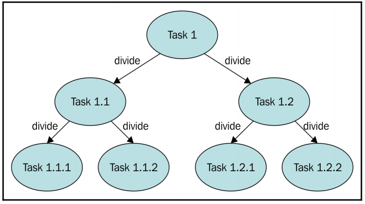

<h1 align="center"> ITF23019 - Parallel and Distributed Programming </h1>
<h3 align="center"> Spring 2021 </h2>
<h3 align="center"> Lab 3: Java Fork/Join Framework </h2>

In this lab, you will learn how to develop data parallelism program with Java Fork/Join Framework.

 

## Submission Deadline:

You need to commit your codes and lab report to your GitHub repository **before 10:00 AM Monday 8th February**.

## GitHub

If you have not config your `labs-yourusername` repository for upstream remote repository, please go back to the instruction from `lab2`.

Remember to commit and push your changes before starting this lab. Then, start the **Command Prompt** of GitHub Desktop and run the command:

```bash
> git pull upstream main
```

Then, **push** everything to your `labs-yourusername`.

## An Introduction To The Fork/Join Framework

The **Executor Framework**, which we learn from `lab2`, provides a mechanism to execute concurrent tasks without creating, starting, and finishing threads. This framework uses a pool of threads that executes the tasks you send to the executor, reusing them for multiple tasks.

The **Fork/Join Framework** goes a step further and includes an additional implementation of the `ExecutorService` interface oriented to divide-and-conquer problems. We can use this framework to develop data parallelism programs.

This framework is designed to solve problems that can be **broken into smaller tasks** using the divide and conquer technique. Inside a task, you check **the size of the problem** you want to resolve, and if it's bigger than **a threshold**, you divide it into smaller tasks that are executed using the framework. If the size of the problem is **smaller than the threshold**, you **solve the problem directly in the task**, and then, optionally, it returns a result. The following diagram summarizes this concept:




 Your code should look similar to the following pseudocode:

```
if (size of the task is smaller than threshold)
  do the task directly
else
  Divide the task into two smaller tasks
  invoke the two tasks and wait for the results
```

There is no formula to determine the **threshold** that determines if a task is to be subdivided or not, depending on its characteristics. You can use the number of elements to process in the task and an estimation of the execution time to determine the reference size. Test different reference sizes to choose the best one for your problem.

The framework is based on the following two operations: 

* **Fork operation**: When you divide a task into smaller tasks and execute them using the framework. 
* **Join operation**: When a task waits for the finalization of the tasks it has created. It's used to combine the results of those tasks.

The main difference between the fork/join and the Executor frameworks is the **work-stealing** algorithm. Unlike the Executor framework, when a task is waiting for the finalization of the subtasks it has created using the join operation, the thread that is executing that task (called **worker thread**) looks for other tasks that have not been executed yet and begins their execution. In this way, the threads take full advantage of their running time, thereby improving the performance of the application.

The core of the fork/join framework is formed by the following two classes:

* `ForkJoinPool`: This class implements the `ExecutorService` interface and the work-stealing algorithm. It manages the worker threads and offers information about the status of the tasks and their execution. 
* `ForkJoinTask`: This is the base class of the tasks that will execute in the `ForkJoinPool`. It provides the mechanisms to execute the `fork()` and `join()` operations (and their different variants), inside a task and the methods to control the status of the tasks. Usually, to implement your fork/join tasks, you will implement a subclass of two subclasses of this class: `RecursiveAction` **for tasks with no return result**, `RecursiveTask` **for tasks that return one result**.

## Create `RecursiveAction` For Tasks With No Return Result

In this example, we are going to implement a task to update the price of a list of products. The provided code is in `demo-recursive-action` project. The initial task will be responsible for updating all the elements in a list (there are 10 000 000 elements). You will use a size 10 as the threshold, so if a task has to update more than 10 elements, it divides the part of the list assigned to it in two parts and creates two tasks to update the prices of the products in the respective parts.

The product is defined in `Product` class which has two attributes: `name` and `price`:

```java
public class Product {
	
	/**
	 * Name of the product
	 */
	private String name;
	
	/**
	 * Price of the product
	 */
	private double price;
```

The `ProductListGenerator` provides utilities to generate random products.

The task is implement in `Task` class and extends the `RecursiveAction` class. This class contains a list of `products` to be updated, the indices `first` and `last` which contains the first and the last position in the the list of products that are assigned to the task, the `increment` contain the percentage of the price to be updated.

```java
public class Task extends RecursiveAction {

	/**
	 * serial version UID. The ForkJoinTask class implements the serializable
	 * interface.
	 */
	private static final long serialVersionUID = 1L;

	/**
	 * List of products
	 */
	private List<Product> products;

	/**
	 * Fist and Last position of the interval assigned to the task
	 */
	private int first;
	private int last;

	/**
	 * Increment in the price of products this task has to apply
	 */
	private double increment;

	/**
	 * Constructor of the class. Initializes its attributes
	 * 
	 * @param products  list of products
	 * @param first     first element of the list assigned to the task
	 * @param last      last element of the list assigned to the task
	 * @param increment price increment that this task has to apply
	 */
	public Task(List<Product> products, int first, int last, double increment) {
		this.products = products;
		this.first = first;
		this.last = last;
		this.increment = increment;
	}
```

The main method that implement the task is `compute()` method. As mentioned earlier, it checks if the size of the task is smaller than 10 and update the price directly. Otherwise, it divide the tasks into two equal tasks: `t1` and `t2`.  Start the child threads with `fork()` and wait for the tasks to finish.

```java
	/**
	 * Method that implements the job of the task
	 */
	@Override
	protected void compute() {
		if (last - first < 10) {
			updatePrices();
		} else {
			int middle = (last + first) / 2;
			// System.out.printf("Task: Pending tasks: %s\n",getQueuedTaskCount());
			Task t1 = new Task(products, first, middle + 1, increment);
			Task t2 = new Task(products, middle + 1, last, increment);
			
			t1.fork();
			t2.fork();
			t1.join();
			t2.join();
			
		}
	}

	/**
	 * Method that updates the prices of the assigned products to the task
	 */
	private void updatePrices() {
		for (int i = first; i < last; i++) {
			Product product = products.get(i);
			product.setPrice(product.getPrice() * (1 + increment));
		}
	}
```

The `main` function generates 10 000 000 product, create the main task and the `ForkJoinPool`. Finally it starts executing the main task.

```java
public static void main(String[] args) {

		// Create a list of products
		ProductListGenerator generator=new ProductListGenerator();
		List<Product> products=generator.generate(10_000_000);
		
		// Create a task
		Task task=new Task(products, 0, products.size(), 0.20);
		
		// Create a ForkJoinPool
		ForkJoinPool pool= ForkJoinPool.commonPool();
		
		// Execute the Task
		pool.execute(task);
```


## Exercise 1 (20 points):

There are multiple ways to "fork" and "join" the tasks. One way is in previous example where we use the two methods `fork()` and `join()`. Another way is to "fork" and "join" only one task and "compute" the other task direction. One more way is using `invokeAll()` method:

```java
//Option 1:
t1.fork();
t2.fork();
t1.join();
t2.join();

//Option 2:
t1.fork();
t2.compute();
t1.join();

//Option 3:
invokeAll(t1, t2);
```

Discuss any differences or similarities among these options.

## Create `RecursiveTask` For Tasks That Return One Result

In this example, we are going to implement a task that computes the sum of prices of a list of products. The provided code is in `demo-recursive-task`. The `Product` class has the same structure as in previous example. The task is implemented in `Task` class which extends the `RecursiveTask` class. `RecursvieTask` is a generic task which has a type `Double` that indicates the data type of the result.

```java
public class Task extends RecursiveTask<Double> {

	/**
	 * serial version UID. The ForkJoinTask class implements the serializable
	 * interface.
	 */
	private static final long serialVersionUID = 1L;

	/**
	 * List of products
	 */
	private List<Product> products;

	/**
	 * Fist and Last position of the interval assigned to the task
	 */
	private int first;
	private int last;

	/**
	 * Increment in the price of products this task has to apply
	 */
	private double increment;

	/**
	 * Constructor of the class. Initializes its attributes
	 * 
	 * @param products  list of products
	 * @param first     first element of the list assigned to the task
	 * @param last      last element of the list assigned to the task
	 * @param increment price increment that this task has to apply
	 */
	public Task(List<Product> products, int first, int last, double increment) {
		this.products = products;
		this.first = first;
		this.last = last;
		this.increment = increment;
	}
```

In the `compute()`, the task has to return a value which is the sum of the products that are assigned to it. Specifically, if the number of products is less than 10, the task computes the sum directly. Otherwise, it divides the list of the product into two equal lists and assigns them to two tasks: `t1` and `t2`. These two tasks will be executed simultaneously by the thread pool with `invokeAll` method. Finally, the parent task computes the sum of the result from the two children tasks.

```java
/**
	 * Method that implements the job of the task
	 * 
	 * @return
	 */
@Override
protected Double compute() {

    Double result = null;
    if (last - first < 10) {
        result =  computePrices();
    } else {
        int middle = (last + first) / 2;

        Task t1 = new Task(products, first, middle + 1, increment);
        Task t2 = new Task(products, middle + 1, last, increment);
        invokeAll(t1, t2);

        try {
            result =  t1.get() + t2.get();
        } catch (InterruptedException | ExecutionException e) {
            e.printStackTrace();

        }
    }

    return result;
}
```

## Exercise 2 (10 points):

In above example, to start the children tasks, instead of using `invokeAll()` method, we can use the `fork()` on both tasks, and then compute the sum:

```java
//Option1:
//invokeAll(t1, t2);

//Option2:
t1.fork();
t2.fork();

try {
    result =  t1.get() + t2.get();
} catch (InterruptedException | ExecutionException e) {
    e.printStackTrace();

}
```

Explain why it is unnecessary to `join()` the two tasks in this case.

## Exercise 3 (10 points):

Provide a code snippet for the third option in which we will "fork" only one task and "compute" the other task direction. How does the parent task combine the results?

## Exercise 4 (30 points): 

In this exercise, we are going to implement a task that compute the sum of an array. The starter code is provided in `array-sum` project. 

The serial version of this problem is implemented in `ArraySumSerial`.  

The parallel version uses `RecursiveAction` class. The Task is implemented in `ArraySumTask`. Since `RecursiveAction` does not return a result, the `ArraySumTask` has to implement the method `getSum()` to return the sum of the task.

The `ArraySumParallel` creates the thread pool and start the task. 

The `Main` tries to run each version 10 times and compute the running times.

Your task for this exercise is to complete the implementation of the `compute()` method in `ArraySumTask`  and compute the speedup in the `Main`.

## Exercise 5 (30 point)

`ArraySumTask` in the previous exercise returns a result but does not use `RecursiveTask`. It implements a function called `getSum()` to return the result to the parent task instead.

Your task for this exercise is implement the task using `RecursiveTask`. 

Create a project and name it `no.hiof.itf23019.array-sum-recursive-task` for this exercise. Remember to compute the speed up for your implementation. 

## Bonus Exercise (20 points)

Your task for this exercise is to implement a task that compute the  sum of reciprocals of an array.  The sum is computed as follow:

```java
double sequentialReciprocalSum(final double[] input) {
    double sum = 0;

    // Compute sum of reciprocals of array elements
    for (int i = 0; i < input.length; i++) {
        sum += 1 / input[i];
    }

    return sum;
}
```

Create a project and name it `no.hiof.itf23019.reciprocal-sum` for this exercise.

Use the fork/join framework to implement the parallel version of this task. You may reuse the structure of the task in `array-sum` project. 

Remember to analyze the speedup of your implementation. 

## What To Submit

Complete the the exercises in this lab and put your code along with **lab3_report** (Markdown, TXT or PDF file) into the **lab3** directory of your repository. Commit and push your changes and remember to check the GitHub website to make sure all files have been submitted.

## References:

1. González, Javier Fernández. *Mastering Concurrency Programming with Java 9*. Packt Publishing Ltd, 2017.
2. González, Javier Fernández. *Java 9 Concurrency Cookbook*. Packt Publishing Ltd, 2017.
3. [Java Fork/Join Framework Tutorials](https://docs.oracle.com/javase/tutorial/essential/concurrency/forkjoin.html)


